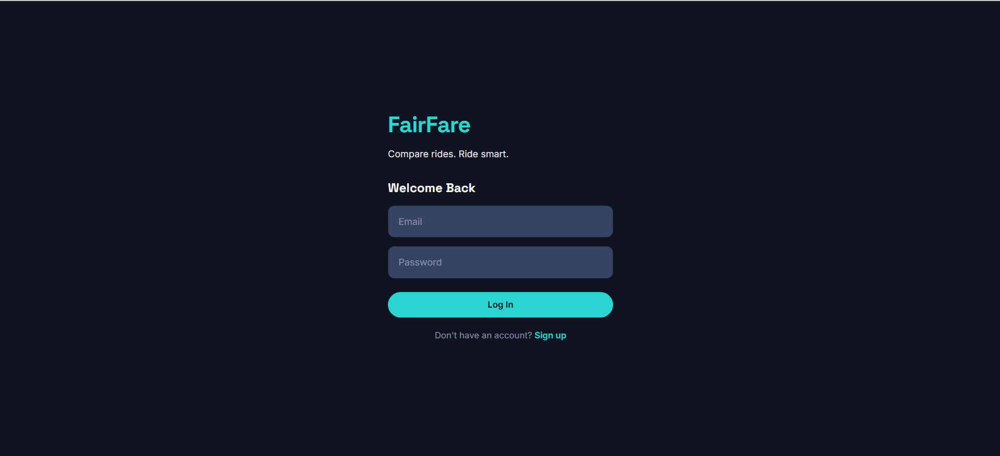
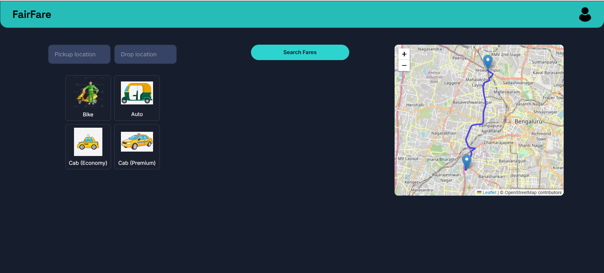
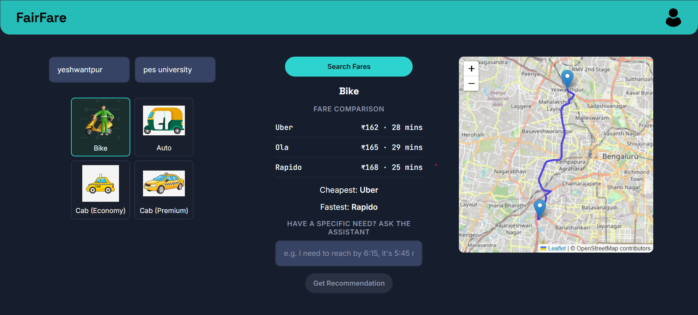
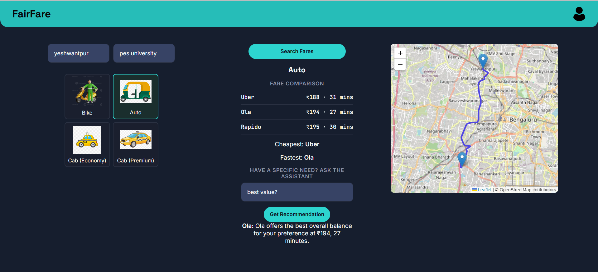

# FairFare

A ride-fare comparison platform that helps users compare prices and travel times across multiple ride categories (Bike, Auto, Cab Economy, Cab Premium) and simulated ride-hailing services, with an AI-powered assistant that recommends the best option based on natural-language preferences.

## Overview

Choosing between ride-hailing options often means manually comparing prices and wait times across multiple apps. FairFare consolidates this into a single interface: enter a pickup and drop location, select a vehicle category, and instantly see a fare and ETA comparison — along with an AI assistant that can answer specific questions like "I need to reach in 20 minutes" or "I only have ₹200" and recommend the best-fitting option with reasoning.

This project was built to explore full-stack development end-to-end — authentication, real-world API integration (geocoding, routing, mapping), relational database design, and practical, reliability-conscious AI integration using an LLM.

**Note on fare data**: Real-world distance and travel time are calculated using live routing data (OpenStreetMap/OSRM). However, the specific fares shown for "Uber," "Ola," and "Rapido" are **simulated** using a custom pricing model built for this project — they are not fetched from the actual ride-hailing providers' APIs, since those are not publicly available. Service names are used for realistic comparison purposes only.

## Features

- **User authentication** — signup/login with hashed passwords (bcrypt), JWT-based sessions, and email-based OTP password recovery
- **Real-world routing** — accurate distance and travel time calculated via OpenStreetMap geocoding and routing services
- **Tiered, distance-based pricing** — per-vehicle-category pricing model (Bike, Auto, Cab Economy, Cab Premium)
- **AI recommendation assistant** — interprets natural-language preferences (time constraints, budget constraints, or general priorities) and recommends the best option with a reasoned explanation
- **Interactive map** — displays the computed route between pickup and drop locations
- **Search history** — persistent record of past searches per user
- **Recent-location suggestions** — auto-suggests recently used pickup/drop locations

## Tech Stack

**Backend**: Python, Flask, PostgreSQL (hosted via Supabase), Groq API (Llama 3.1)
**Frontend**: React, Vite
**Mapping & Routing**: Leaflet.js, OpenStreetMap (Nominatim for geocoding, OSRM for routing)
**Auth & Security**: JWT, bcrypt
**Other**: SMTP (Gmail) for OTP email delivery

## Project Structure

```
FairFare/
├── backend/
│   ├── app.py              # Flask application, all API routes
│   ├── requirements.txt    # Python dependencies
│   └── .env                # Environment variables (not committed)
├── frontend/
│   ├── src/
│   │   ├── App.jsx         # Main application component
│   │   ├── Auth.jsx        # Login/signup component
│   │   ├── Map.jsx         # Leaflet map component
│   │   ├── App.css         # Global styles
│   │   └── index.css       # Base reset
│   └── public/              # Static assets (icons, images)
└── README.md
```

## Installation

### Prerequisites
- Python 3.8+
- Node.js 18+
- A PostgreSQL database (e.g., via [Supabase](https://supabase.com))
- A [Groq API key](https://console.groq.com/keys) (free)
- A Gmail account with an [App Password](https://myaccount.google.com/apppasswords) generated (for OTP emails)

### Backend Setup

```bash
cd backend
python -m venv venv
venv\Scripts\activate       # Windows
source venv/bin/activate    # macOS/Linux
pip install -r requirements.txt
```

### Frontend Setup

```bash
cd frontend
npm install
```

## Environment Variables

Create a `.env` file inside the `backend/` folder with the following:

| Variable | Description |
|---|---|
| `DATABASE_URL` | PostgreSQL connection string |
| `JWT_SECRET` | Secret key used to sign authentication tokens |
| `GROQ_API_KEY` | API key for the Groq LLM service |
| `EMAIL_ADDRESS` | Gmail address used to send OTP emails |
| `EMAIL_APP_PASSWORD` | Gmail App Password (not your regular account password) |

## How to Run

**Backend** (from `backend/`, with the virtual environment active):
```bash
python app.py
```
Runs on `http://127.0.0.1:5000`

**Frontend** (from `frontend/`):
```bash
npm run dev
```
Runs on `http://localhost:5173`

## Database Schema

The application uses four main tables:
- `users` — account credentials and profile info
- `fare_searches` — search history, linked to `users` via foreign key
- `password_resets` — OTP codes for password recovery

## API Documentation

| Method | Endpoint | Description |
|---|---|---|
| POST | `/api/signup` | Create a new account |
| POST | `/api/login` | Authenticate and receive a JWT |
| POST | `/api/update-username` | Update the logged-in user's display name |
| POST | `/api/forgot-password` | Request a password reset OTP via email |
| POST | `/api/reset-password` | Reset password using a valid OTP |
| POST | `/api/search-fares` | Get fare/ETA comparison for a pickup, drop, and vehicle mode |
| POST | `/api/recommend` | Get an AI-generated recommendation based on a stated preference |
| GET | `/api/search-history` | Retrieve the user's recent search history |
| GET | `/api/recent-locations` | Get recently used pickup/drop locations for autocomplete |
| GET | `/api/last-location` | Get the user's last-used location (for default map center) |

All routes except signup, login, and password reset require a valid `Authorization: Bearer <token>` header.

## Future Improvements

- Parallelize pickup/drop geocoding requests to reduce search latency
- Dark/light mode toggle
- Full search history page with filtering
- Migrate to a dedicated transactional email service for more reliable OTP delivery
- Explore LLM "tool use" / function calling for more flexible preference parsing

## Screenshots

### Login


### Home


### Fare Comparison (no ai recommendation)


### Fare Comparison (with ai recommendation)
